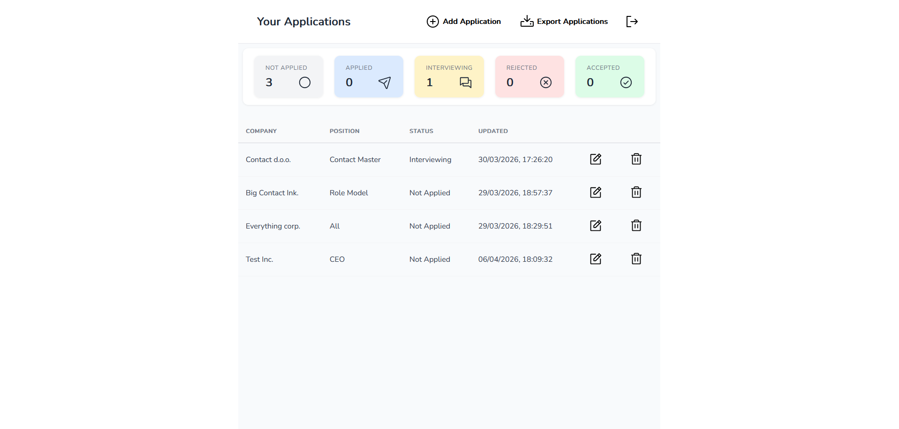
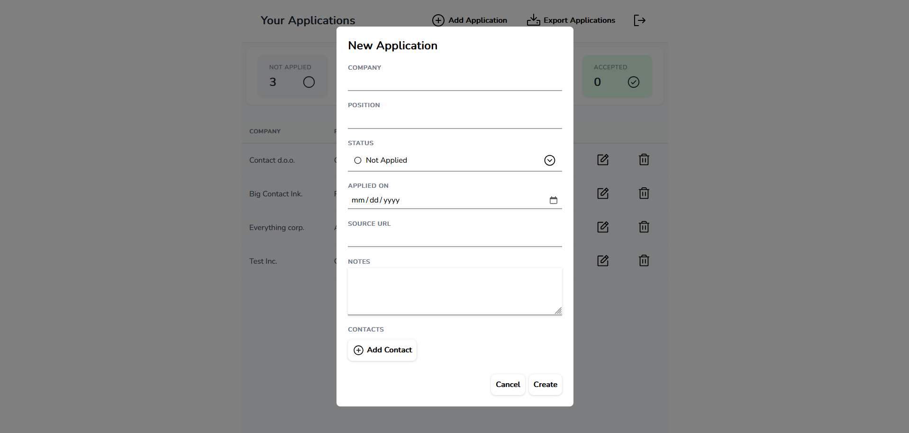
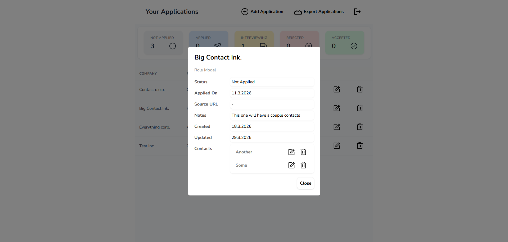
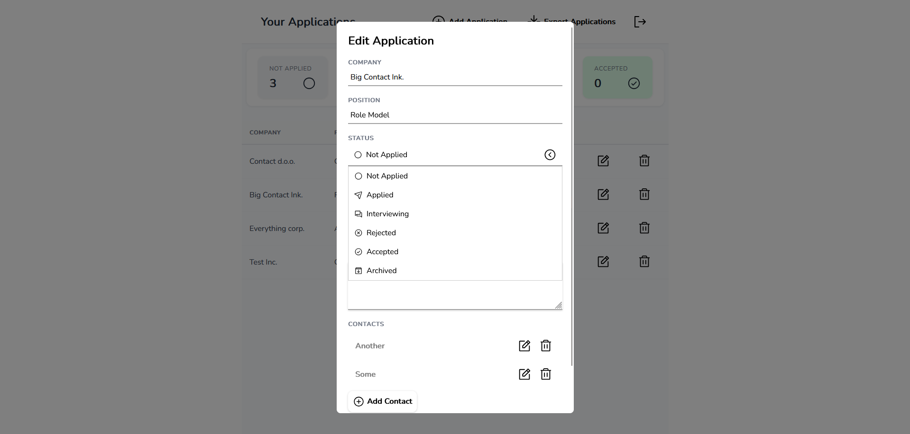
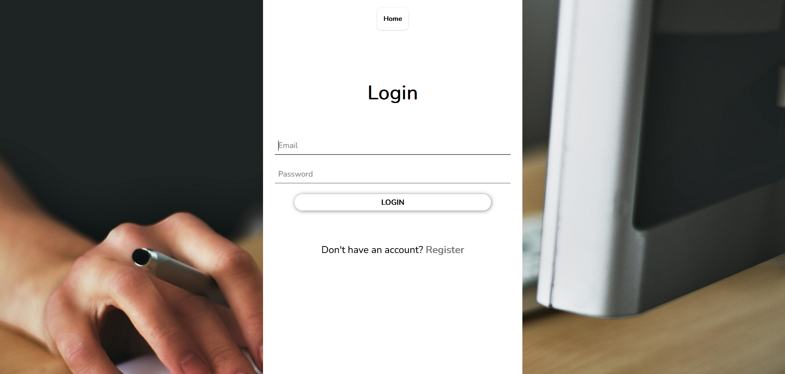
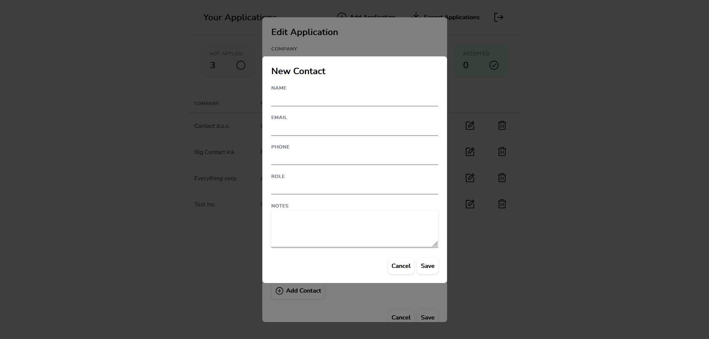
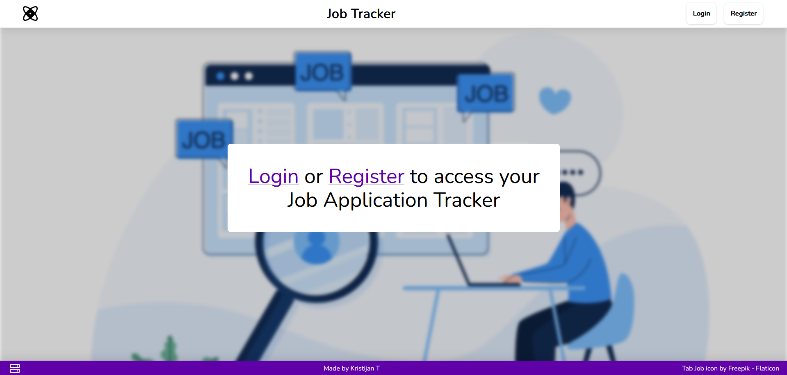

# Job Tracker

A full-stack web application for tracking job applications, managing contacts, and staying organized during your job search.

Built with **ASP.NET Core 8**, **React + TypeScript**, and **PostgreSQL**.



---

## Features

- **Authentication** — Register and log in with email/password (JWT-based)
- **Application CRUD** — Create, view, edit, and delete job applications
- **Status tracking** — Filter by status: Not Applied, Applied, Interviewing, Rejected, Accepted
- **Contacts** — Attach contacts (recruiters, hiring managers) to each application
- **CSV export** — Download all your applications as a `.csv` file
- **Data isolation** — Each user only sees their own data
- **CI pipeline** — Automated build, lint, and tests on every push



---

## Tech Stack

| Layer | Technology |
|---|---|
| **Frontend** | React 19, TypeScript, Vite |
| **Backend** | ASP.NET Core 8 Minimal API |
| **Auth** | ASP.NET Core Identity + JWT |
| **Database** | PostgreSQL 16 |
| **ORM** | Entity Framework Core 8 |
| **Testing** | xUnit, WebApplicationFactory, SQLite in-memory |
| **CI** | GitHub Actions |
| **Dev environment** | Docker Compose |

---

## Project Structure

```
job-tracker/
├── backend/
│   ├── src/JobTracker/
│   │   ├── JobTracker.Api/           # Endpoints, auth, DTOs
│   │   ├── JobTracker.Domain/        # Entities, enums
│   │   └── JobTracker.Infrastructure/# EF Core, DbContext, migrations
│   └── tests/
│       └── JobTracker.Api.Tests/     # Integration tests
├── frontend/
│   └── src/
│       ├── api/                      # API client functions
│       ├── components/               # Reusable UI components
│       ├── pages/                    # Page components + modals
│       └── styles/                   # CSS modules
├── deploy/
│   └── docker-compose.yml            # Local dev environment
└── .github/
    └── workflows/
        └── ci.yml                    # Build + test pipeline
```

---

## API Endpoints

### Auth
| Method | Route | Description |
|---|---|---|
| `POST` | `/auth/register` | Create a new account |
| `POST` | `/auth/login` | Log in, receive JWT |
| `GET` | `/auth/me` | Get current user info (🔒) |

### Applications
| Method | Route | Description |
|---|---|---|
| `GET` | `/applications` | List all your applications (🔒) |
| `POST` | `/applications` | Create a new application (🔒) |
| `GET` | `/applications/{id}` | Get application details (🔒) |
| `PUT` | `/applications/{id}` | Update an application (🔒) |
| `DELETE` | `/applications/{id}` | Delete an application (🔒) |
| `GET` | `/applications/export` | Export applications to CSV (🔒) |

### Contacts
| Method | Route | Description |
|---|---|---|
| `GET` | `/applications/{id}/contacts` | List contacts for an application (🔒) |
| `POST` | `/applications/{id}/contacts` | Add a contact (🔒) |
| `PUT` | `/applications/{id}/contacts/{contactId}` | Update a contact (🔒) |
| `DELETE` | `/applications/{id}/contacts/{contactId}` | Delete a contact (🔒) |

🔒 = Requires JWT authentication

---

## Data Model

```
User (ASP.NET Identity)
 └── JobApplication
      ├── id, companyName, position, status
      ├── appliedOn, sourceUrl, notes
      ├── createdAtUtc, updatedAtUtc
      └── Contact[]
           ├── name, email, phone
           ├── role, notes
           └── FK → JobApplication (cascade delete)
```



---

## Getting Started

### Prerequisites

- [.NET 8 SDK](https://dotnet.microsoft.com/download/dotnet/8.0)
- [Node.js 22+](https://nodejs.org/)
- [Docker Desktop](https://www.docker.com/products/docker-desktop/)

### 1. Start the database

```bash
cd deploy
docker compose up -d
```

This starts PostgreSQL on port `5433`.

### 2. Run the backend

```bash
cd backend/src/JobTracker
dotnet ef database update --project JobTracker.Infrastructure --startup-project JobTracker.Api
dotnet run --project JobTracker.Api
```

The API starts at `https://localhost:7053`. Swagger UI available at `/swagger`.

### 3. Run the frontend

```bash
cd frontend
npm install
npm run dev
```

The frontend starts at `http://localhost:5173` and proxies API calls to the backend.

---

## Running Tests

### Backend (integration tests)

```bash
cd backend/tests/JobTracker.Api.Tests
dotnet test
```

Tests use **SQLite in-memory** via `WebApplicationFactory` to spin up the full API pipeline — no external database required.

**Test coverage includes:**
- Auth: registration, duplicate email rejection, login, wrong password, protected endpoints
- CRUD: create, list, update, delete applications
- Data isolation: users cannot access each other's data

### Frontend

```bash
cd frontend
npm run lint
npm run build
```

---

## CI Pipeline

GitHub Actions runs on every push and pull request to `master`:

| Job | What it does |
|---|---|
| **Backend** | Restore → Build → Run integration tests |
| **Frontend** | Install → Lint → Build |

[](https://github.com/KristijanTuric/job-tracker/actions/workflows/ci.yml)

---

## Security Notes

- **Password hashing** — Handled by ASP.NET Core Identity (PBKDF2 by default)
- **JWT expiration** — Access tokens expire after 1 hour
- **Data isolation** — Every database query filters by `OwnerId` from the JWT claims; users can never access each other's data
- **CORS** — Configured to only allow the frontend origin in production

---

## Tradeoffs

| Decision | Why |
|---|---|
| **No refresh tokens (yet)** | Access tokens expire in 1 hour. For an MVP, re-login is acceptable. Refresh tokens add complexity (rotation, storage, revocation) that isn't needed yet. |
| **SQLite for tests, not Testcontainers** | SQLite in-memory is fast, requires no Docker in CI, and enforces constraints well enough for integration tests. Testcontainers with real Postgres is more realistic but adds CI setup overhead. |
| **No frontend tests** | Prioritized backend integration tests for correctness. Frontend E2E tests (Playwright/Cypress) are a logical next step. |

---

## Screenshots

| Dashboard | Create Application | Edit Application |
|---|---|---|
|  |  |  |

| Login | Contacts | Homepage |
|---|---|---|
|  |  |  |

---

## License

This project is for portfolio/educational purposes.
